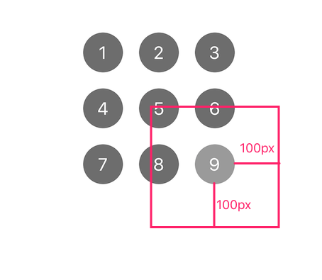

# Tips 
**踩坑笔记 - 记录开发中碰到的一些问题，以防日后继续踩坑**

:desktop_computer: :horse: :man_farmer: :knife: :bug:


* [2019](#2019)
* [po的完整版](#po的完整版)
* [微信小程序camera组件录像30s偶发超时问题](#微信小程序camera组件录像30s偶发超时问题)
* [保证当前是主线程的正确姿势](#保证当前是主线程的正确姿势)
* [NSMapTable 的使用](#nsmaptable-的使用)
* [图片解压缩方案​](#图片解压缩方案)
* [2018](#2018)
* [在数据库中递归子节点并建立表关联实现快速检索](#在数据库中递归子节点并建立表关联实现快速检索)
* [使用宏判断输入的路径参数是否合法，并且给出代码提示](#使用宏判断输入的路径参数是否合法并且给出代码提示)
* [NS_ENUM 与 NS_OPTIONS](#ns_enum-与-ns_options)
* [UIControl拖拽移出控件问题](#uicontrol拖拽移出控件问题)
* [判断两张UIImage全等](#判断两张uiimage全等)
* [继承和面向接口编程](#继承和面向接口编程)
* [继承](#继承)
* [面向切面AOP](#面向切面aop)
* [面向接口](#面向接口)
* [多态和面向接口](#多态和面向接口)
* [面向接口实现顺序控制](#面向接口实现顺序控制)
* [build setting优化](#build-setting优化)
* [gem安装的坑](#gem安装的坑)


## 2019

### po的完整版

```objc
expr   变量|表达式              //显示变量或者表达式的值。
expr -f h --  变量|表达式       //以16进制格式显示变量或表达式的内容
expr -f b --  变量|表达式       //以二进制格式显示变量或者表达式的内容。
expr -o --  oc对象             //等价于po  oc对象
expr -P  3 -- oc对象           //上面命令的加强版本，他还会显示出对象内数据成员的结构，具体的P后面的数字就是你要想显示的层次。
expr my_struct->a = my_array[3]    //给my_struct的a成员赋值。
expr (char*)_cmd               //显示某个oc方法的方法名。
expr (IMP)[self methodForSelector:_cmd]    //执行某个方法调用.
```

真机使用的架构是[arm64指令集](https://blog.csdn.net/zqixiao_09/article/details/50726544)，模拟器使用的是x64指令集。可进入汇编调试模式调试。


### 微信小程序camera组件录像30s偶发超时问题

在初始化`camera`上下文时，若要多次进行录像操作，必须制定`id`（文档中没有相关说明）。

不指定`id`,在进行多次录制时，会初始化多个上下文，`stop`操作会造成上一次的录制未停止，导致录制超时。

```objc
wx.createCameraContext('myCamera')
```


### 保证当前是主线程的正确姿势

之前在开发中刷新UI时回到主线程一般都是使用：

```objc
if ([NSThread isMainThread]) {
block();
} else {
dispatch_async(dispatch_get_main_queue(), block);
}
```

但是在一些场合需要判断的是**如果在主线程执行非主队列调度的API，而这个API需要检查是否是在主队列上调度，那么将会出现问题。**也就是说需要判断的是**主队列**而不是**主线程**。

更安全的方法：

```objc
dispatch_main_async_safe(block) {
if (strcmp(dispatch_queue_get_label(DISPATCH_CURRENT_QUEUE_LABEL), dispatch_queue_get_label(dispatch_get_main_queue())) == 0) {
block();
} else {
dispatch_async(dispatch_get_main_queue(), block);\
}
}
```

解析：

`dispatch_queue_get_label(DISPATCH_CURRENT_QUEUE_LABEL)`：每个`queue`都有一个唯一的`label`，这是获取当前队列的`label`。

`dispatch_queue_get_label(dispatch_get_main_queue()`：获取主队列的`label`。

`strcmp（A, B）== 0`: 判断当前队列是否是主队列。

**这个方法将判断是否在主线程执行改为了是否在主队列执行，因为主队列无论是同步还是异步，都不会开辟新的线程，即都是在主线程执行。=> 主队列调度的任务一定在主线程执行，而主线程执行的任务则不一定是在主队列调度**


### NSMapTable 的使用

在翻看`SDWebImage`源码时，无意中发现原本的`imageCache`从`NSCache`为了`NSMapTable`。正好复习一下`NSMapTable`。

`NSMapTable`一般都是和`NSDictionary`一起讲解的。`NSDictionary`一般适用于`key` => `object`，且`key`和`object`都只能是`OC`对象，由于`NSDictionary`是通过`key`来索引`object`的，`key`一旦被修改就无法找到`object`了，所以`NSDictionary`始终会复制`key`到自己的私有空间（`key`必须支持 `NSCopying` 协议）。因此一般使用简单高效的对象来作为key（例如`NSString`、`NSNumber`），以至于复制的时候不会对 CPU 和内存造成负担。

如果要做对象到对象的映射，我们可以使用**`NSMapTable`**：

```objc
- (instancetype)initWithKeyPointerFunctions:(NSPointerFunctions *)keyFunctions valuePointerFunctions:(NSPointerFunctions *)valueFunctions capacity:(NSUInteger)initialCapacity;
```

- `NSMapTableStrongMemory`: 强引用

- `NSMapTableWeakMemory`: 弱引用

- `NSMapTableObjectPointerPersonality` :将对象添加到集合中时是否调用对象上的 `isEqualTo：` 和 `hash` 方法

- `NSMapTableCopyIn`:  复制一份，可以设置`key`为该属性 => `NSDictionary`

​

### 图片解压缩方案​

加载图片主要有以下三种方法：

```objc
- (nullable UIImage *)imageNamed:(NSString *)name;//同时会加载图片到内存中

- (nullable UIImage *)imageWithContentsOfFile:(NSString *)path;//不会缓存到内存中，适合较大的不常用的图片

- (nullable UIImage *)imageWithData:(NSData *)data;//不缓存，适合于加载网络图片
```

**iOS加载图片流程：**

当使用`imageWithContentsOfFile`从地址中获取图片时，图片并没有解压缩，此时的图片是无法显示的，在渲染到屏幕之前，必须先要得到图片的原始像素数据（位图）。

将生成的image赋值给UIImageView，此时`CoreAnimation（CA）`的事务`（CATrasaction）`会捕获到`UIImageView`图层树的变化，在主线程的下一个`runloop`到来时，`CA`会提交这个事务:

1. 分配内存缓冲区用于管理文件`IO`和解压缩操作。
2. 从磁盘中读取图片数据到内存中。
3. 在**主线程**中将图片数据解码成未压缩的位图形式（**耗时操作**）
4. 最后将位图渲染到`UIImageView `的图层上

在以上操作中将图片解码成位图是一个在主线程中的耗时操作，因此很有必要将它放到子线程中提前解码成位图，再在主线程中渲染图片。**而强制解压缩的原理就是对图片进行重新绘制，得到一张新的解压缩后的位图。**

**SDWebImage图片解压缩**

SDWebImage在从磁盘获取图片数据时，会根据图片是否包含Alpha通道以及是否图片存储时是否被缩小（iOS缓存操作60M的图片时，会缩小图片再进行缓存`SDImageCacheScaleDownLargeImages`）进行解压缩。

```objc
- (nullable UIImage *)sd_decompressedImageWithImage:(nullable UIImage *)image {
    if (![[self class] shouldDecodeImage:image]) {
        return image;
    }
    
    // autorelease the bitmap context and all vars to help system to free memory when there are memory warning.
    // on iOS7, do not forget to call [[SDImageCache sharedImageCache] clearMemory];
    @autoreleasepool{//自动释放池，释放变量
        
        CGImageRef imageRef = image.CGImage;
        // device color space
        CGColorSpaceRef colorspaceRef = SDCGColorSpaceGetDeviceRGB();//色域
        BOOL hasAlpha = SDCGImageRefContainsAlpha(imageRef);
        // iOS display alpha info (BRGA8888/BGRX8888)
        CGBitmapInfo bitmapInfo = kCGBitmapByteOrder32Host;//kCGBitmapByteOrder32Little iPhone是小端模式，数据以32位位单位
        //位图布局信息 有Alpha通道时，将A通道乘以RGB，无Alpha通道时，跳过
        bitmapInfo |= hasAlpha ? kCGImageAlphaPremultipliedFirst : kCGImageAlphaNoneSkipFirst;
        
        size_t width = CGImageGetWidth(imageRef);
        size_t height = CGImageGetHeight(imageRef);
        
        // kCGImageAlphaNone is not supported in CGBitmapContextCreate.
        // Since the original image here has no alpha info, use kCGImageAlphaNoneSkipLast
        // to create bitmap graphics contexts without alpha info.
        CGContextRef context = CGBitmapContextCreate(NULL,//data系统会自动分配和是否内存
                                                     width,//位图宽高，即像素数量
                                                     height,
                                                     kBitsPerComponent,//像素的每个颜色分量使用的 bit 数
                                                     0,//位图的每一行使用的字节数=》大小至少为4 * width，指定0时系统不仅会为我们自动计算，而且还会进行 cache line alignment 的优化。优化过程不了解。。。这么用就好
                                                     colorspaceRef,//色域 使用RGB
                                                     bitmapInfo);//位图布局信息
        if (context == NULL) {
            return image;
        }
        
        // Draw the image into the context and retrieve the new bitmap image without alpha
        CGContextDrawImage(context, CGRectMake(0, 0, width, height), imageRef);
        CGImageRef imageRefWithoutAlpha = CGBitmapContextCreateImage(context);
        UIImage *imageWithoutAlpha = [[UIImage alloc] initWithCGImage:imageRefWithoutAlpha scale:image.scale orientation:image.imageOrientation];
        CGContextRelease(context);
        CGImageRelease(imageRefWithoutAlpha);
        
        return imageWithoutAlpha;
    }
}
```

## 2018

### 在数据库中递归子节点并建立表关联实现快速检索

我们在开发过程中遇到大数据检索时，如果直接对多个表数据分别进行检索将很可能会导致很严重的性能问题，导致页面卡顿。

我们可以使用多张表关联的方式来优化该问题：在云办公组织组件中，由于组织树层次深、结构复杂，要计算每个初始节点包含的总人数，如果直接分别计算该节点的每个子节点的人数和，则需要执行多次的查询，势必会出现严重的性能问题。可以用表连接的方式来优化，SQLite 语句如下：


```objc
membersCount = [db intForQuery:[NSString stringWithFormat:
    @"SELECT count(*) from tbl_persons\
    INNER JOIN (\
    WITH RECURSIVE\
    cte(depId, deptName, superDeptCode) AS(\
    SELECT depId,deptName,superDeptCode FROM tbl_deptments WHERE depId=%zd\
    UNION ALL\
    SELECT a.depId, a.deptName, a.superDeptCode FROM tbl_deptments AS a INNER JOIN\
    cte ON a.superDeptCode=cte.depId\
    )\
    SELECT * FROM cte\
    ) AS a ON tbl_persons.deptCode = a.depId\
    where lState=%zd and companyId=%zd",
    deptId, state, [[CLOfficeUser shareInstance].companyId integerValue]]];
```

其中:

```objc
WITH RECURSIVE\
cte(depId, deptName, superDeptCode) AS(\
SELECT depId,deptName,superDeptCode FROM tbl_deptments WHERE depId=%zd\
UNION ALL\
SELECT a.depId, a.deptName, a.superDeptCode FROM tbl_deptments AS a INNER JOIN\
cte ON a.superDeptCode=cte.depId\
)\
SELECT * FROM cte\
```

表示对部门表`tbl_deptments`进行递归查询`superDeptCode`节点下的所有子节点`depId`。

`INNER JOIN` 表示将关联两张表进行查询。


### 使用宏判断输入的路径参数是否合法，并且给出代码提示

在使用 KVO 时，通常要指定一个观察路径`keyPath`,如果该路径字符串拼错或是不存在，编译时并不会报错，只有等到运行时才会发现问题。Facebook开源的`FBKVOController`通过宏定义来解决了这个问题：

```objc
#define keypath(self, path)   \
(((void)(NO && ((void)self.path, NO)), strchr(# PATH, '.') + 1))
```

其中`(((void)(NO && ((void)self.path, NO)), strchr(# PATH, '.') + 1))`是一个逗号表达式，只会计算逗号后面的部分`strchr(# PATH, '.') + 1`，由于前面部分没有使用，编译器会报警告，因此加上`(void)`强制转换类型。

`(NO && ((void)self.path, NO))`NO与运算，直接跳过忽略第一个值，去计算表达式后面的值，且这里使用`(void)self.path`对`path`进行点运算，只要作为表达式的一部分，Xcode会自动提示。

如果传入的`path`不是`self`的属性，那么`self.path`就不是一个合法的表达式，所以自然编译就不会通过了。

使用：

```objc
@keypath(self.personA);//返回@"personA"
```

`keypath(self, path)`返回的是C字符串，前面加@可转为OC对象`NSString`。


### NS_ENUM 与 NS_OPTIONS

使用 `NS_ENUM` 与 `NS_OPTIONS` 宏来定义枚举类型可以指明底层的数据类型。

使用:

```objc
typedef NS_OPTIONS(NSUInteger, UISwipeGestureRecognizerDirection) {
    UISwipeGestureRecognizerDirectionNone = 0,  // 值为0
    UISwipeGestureRecognizerDirectionRight = 1 << 0,  // 值为2的0次方 即左移一位
    UISwipeGestureRecognizerDirectionLeft = 1 << 1,  // 值为2的1次方
    UISwipeGestureRecognizerDirectionUp = 1 << 2,  // 值为2的2次方
    UISwipeGestureRecognizerDirectionDown = 1 << 3  // 值为2的3次方
};

typedef NS_ENUM(NSInteger, NSWritingDirection) {
    NSWritingDirectionNatural = 0,  // 值为0    
    NSWritingDirectionLeftToRight,  // 值为1
    NSWritingDirectionRightToLeft  // 值为2       
};
```

区别:

* `NS_ENUM` 枚举项的值为 `NSInteger`，`NS_OPTIONS` 枚举项的值为 `NSUInteger`

* `NS_ENUM` 定义通用枚举（默认自增步长为 1），`NS_OPTIONS` 定义位移枚举(可以同时存在多个)

* `NS_OPTIONS`的枚举项的值一般使用位运算符定义：`1 << 0，1 << 1`，而 `NS_ENUM` 的值一般直接使用数值：0 1 2

在使用或运算操作两个枚举值时，C++ 默认为运算结果的数据类型是枚举的底层数据类型`(NSUInteger)`,且 C++ 不允许它隐式转换为枚举类型本身，所以 C++ 模式下定义了 `NS_OPTIONS` 宏以保证不会出现类型转换。因此如果OC不按 C++ 模式编译，两者展开方式相同。如果按照 C++ 模式编译, 则存在区别。

结论：只要枚举值需要按位或（2个及以上枚举值可多个存在）就使用 `NS_OPTIONS`，否则使用 `NS_ENUM`。


### UIControl拖拽移出控件问题

我们要自定义控件的互动效果时需要使用 `UIControl`，但是在使用时发现，离开控件时并不会触发 `UIControlEventTouchDragExit` 和 `UIControlEventTouchDragOutside`，实践后发现，离开控件边缘100px时，才会触发该事件。



我们可以使用以下代码来取消这个效果。

```objc
- (BOOL)continueTrackingWithTouch:(UITouch *)touch withEvent:(UIEvent *)event {
    // 设置新的边界
    CGFloat boundsExtension = 0.0f;
    CGRect outerBounds = CGRectInset(self.bounds, -1 * boundsExtension, -1 * boundsExtension);
    // 判断触摸位置
    BOOL touchOutside = !CGRectContainsPoint(outerBounds, [touch locationInView:self]);
    if(touchOutside)
    {
        // 判断是UIControlEventTouchDragExit/UIControlEventTouchDragOutside
        BOOL previousTouchInside = CGRectContainsPoint(outerBounds, [touch previousLocationInView:self]);
        if(previousTouchInside)
        {
            [self sendActionsForControlEvents:UIControlEventTouchDragExit];
        }
        else
        {
            [self sendActionsForControlEvents:UIControlEventTouchDragOutside];
        }
    } else {
        [self sendActionsForControlEvents:UIControlEventTouchDown];
    }
    // 如果不是想要修改的control event，返回原操作
    return [super continueTrackingWithTouch:touch withEvent:event];
}

```


### 判断两张UIImage全等

判断两张图片全像素相等，网络上提供的方法大多如下：

```objc
BOOL isImageEqual(UIImage *image1, UIImage *image2) {
     if (image1 && image2) {
         NSData *data1 = UIImagePNGRepresentation(image1);
         NSData *data2 = UIImagePNGRepresentation(image2);
         BOOL result = [data1 isEqual:data2];
         return result;
     }
     return NO;
 }

```

该方法主要实现思路：采用 `UIImagePNGRepresentation` 将 `UIImage` 转化 `NSData` 之后进行比较。因为：`UIImage` 显示的图片为 BMP 类型图片。它采用位映射存储格式，除了图像深度可选以外，不采用其他任何压缩，因此，BMP 图像所占用的空间很大。而 `UIImagePNGRepresentation` 会将 BMP 转化为 PNG ,其过程是是无损数据压缩的，但经过压缩转化后可能存在相同图片压缩结果不同的情况。

所以以上的判断方法存在三个问题：

- 没有判断两张图片来源是否相同，从资源文件中读出的同一张图片组成不同的 `UIImage` 对象，其指针是相同的，`UIImage` 只是引用，可能产生图片和自身比较的过程。
- 把 `UIImage` 转成 `NSData` 的过程非常耗时。
- 同一张图片的压缩结果可能存在不同。

由于 `UIImage` 使用的图片已经是 BMP 类型的图片，所以只要获取到图片每个像素对应的存储数据进行对比，即可不经过压缩、对比结果绝对精确等。
具体代码如下：

```objc
BOOL isImageEqual(UIImage *image1, UIImage *image2) {
    if (image1 == image2) {
        return YES;
    }
    if (!CGSizeEqualToSize(image1.size, image2.size)) {
        return NO;
    }
    if (image1 && image2) {
        CGImageRef imageRef1 = [image1 CGImage];
        //获取图片像素映射信息
        CFDataRef data1 = CGDataProviderCopyData(CGImageGetDataProvider(imageRef1));
        const unsigned char * buffer1 =  CFDataGetBytePtr(data1);
        CFIndex length1 = CFDataGetLength(data1);

        CGImageRef imageRef2 = [image2 CGImage];
        CFDataRef data2 = CGDataProviderCopyData(CGImageGetDataProvider(imageRef2));
        const unsigned char * buffer2 =  CFDataGetBytePtr(data2);
        CFIndex length2 = CFDataGetLength(data2);

        if (length1 != length2) {
            return NO;
        }
        BOOL result = YES;
        for (long i = 0; i<length1; i++) {
            if(*(buffer1+i) != *(buffer2+i)){
                result = NO;
                break;
            }
        }
        //autoRelease...CG CF object
        return result;
    }
    return NO;
 }

```

经过测试，最差情况下，性能是原方案的4-10倍。


### 继承和面向接口编程

- https://mp.weixin.qq.com/s/dBKemsm9knwJ8tR7fbfX8Q

### 继承

- 优点：代码复用

- 缺点：高耦合

- 使用原则：

  1、父类只给子类提供服务，只做自己的事情，不涉及子类的业务逻辑。不同的业务逻辑由子类自己完成。父类子类互补影响。

  2、父类的变化要在子类中有所体现，将高耦合作为一种需求。

- 替代方案 - 协议

- 替换方案- 组合

- 替换方案- 扩展

- 替换方案- 配置对象


### 面向切面AOP

使用method swizzling来替换继承。 使用需要的方法替换原生的生命周期方法。实现所有类都可以执行该方法。（类似子类执行父类方法）

- load：main函数之前执行，只要存在类即可执行。
- initialize：类的第一个方法被调用之前调用，没有使用的类，不会被调用。


### 面向接口

通过接口的定义，调用者可以忽略对象的属性，聚焦于其提供的接口和功能上。程序猿在首次接触陌生的某个对象时，接口往往比属性更加直观明了，抽象接口往往比定义属性更能描述想做的事情。


### 多态和面向接口

- 继承问题

  父类中会有空的方法，对父类没有任何意义

  架构师写父类，业务工程师写子类，不清楚哪些需要需要覆盖重载，容易出错。

- 面向接口=>面向协议

  OC不支持多重继承

  也没有Interface关键字作为接口实现（Interf只作为类的声明使用）

  通过抽象基类和协议来实现接口：基类定义协议（代理)，在子类中具体实现。


### 面向接口实现顺序控制 

- 函数式编程

  OC主要接祖block实现，将block作为“函数”传递给调用。

- 链式编程

  将方法返回值作为参数，继续调用方法（masonry）

- 利用协议实现顺序控制


### build setting优化

**Architectures**

- Build Active Architecture only：设置是否之编译当前所使用设备对应的arm指令集，debug设为YEs，release设为NO。
- Valid Architectures：项目所支持的arm指令集，支持的越多二进制包越大。


**Optimization**

- Link-Time Optimization：是 LLVM 编译器的一个特性，用于在 link 中间代码时，对全局代码进行优化。这个优化是自动完成的，因此不需要修改现有的代码；这个优化也是高效的，因为可以在全局视角下优化代码。**开启LTO后，一方面可以减少汇编代码的体积，另一方面也提高了代码的运行效率，建议开启Incremental。**

  这里在开启Incremental后有可能会出现duplicate symbols for architecture x86_64的错误，这可能是由于你的代码不规范导致的，全局变量在定义时，.h文件中只能声明变量，而不应该定义变量。在.m中定义全局变量的时候也应该增加命名空间或者使用static关键字避免命名冲突。

- Optimization Level：编译器的优化层度，优化后的代码效率比较高，但是可读性比较差，且编译时间更长。 它一共有以下几个选项:

  - None: 编译器不会尝试优化代码，当你专注解决逻辑错误、编译速度快时使用此项。=》debug
  - Fast: 编译器执行简单的优化来提高代码的性能，同时最大限度的减少编译时间，该选项在编译过程中会使用更多的内存。
  - Faster: 编译器执行所有优化，增加编译时间，提高代码的性能。
  - Fastest: 编译器执行所有优化，改善代码的速度，但会增加代码长度，编译速度慢。
  - Fastest, Smallest: 编译器执行所有优化，不会增加代码的长度，它是执行文件占用更少内存的首选方案=》release

- Optimization ：time存储速度最优，优化时间。space优化编译包大小

**Debug information Format**

- 是否将调试信息加入到可执行文件中
- DWARF：debug
- DWARF with dSYM file：release

**Deployment PostProcessing and Strip Linked Product**

- Deployment PostProcessing：总开关
- Strip Linked Product：优化包大小和编译速度。**当Strip Linked Product设为YES的时候，运行app，断点不会中断，在程序中打印[NSThread callStackSymbols]也无法看到类名和方法名。而在程序崩溃时，函数调用栈中也无法看到类名和方法名。所以一般在release的时候打开就可以了。**


### gem安装的坑

指定gem版本 ：`gem update --system "需要的版本"`

切换ruby：

```
rvm list

rvm current

rvm --default use 2.2.2
```

安装指定cocoapods：`gem install cocoapods --version 1.5.0`

安装指定ruby：

```
rvm list known
rvm install ruby-2.2.2
```


