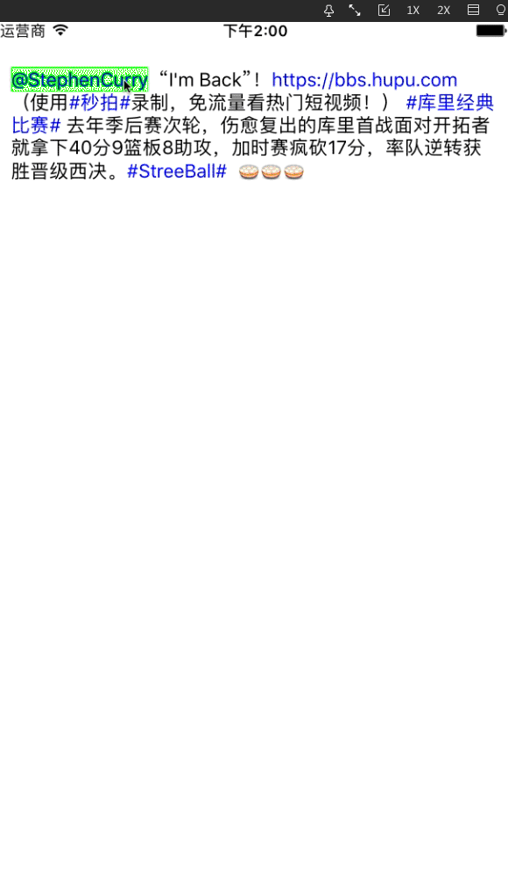

#前言

最近有个项目需要做一个可以对 `UITextView` 内容进行交互的功能，因此做了一个类似新浪微博，可以展示 `Emoji` 、`@somebody` 、`#话题#` 以及`链接`的 Demo 。实现点击特殊字段的文字，并得到一个相应的响应。

<!-- more -->

## 效果图



# 一、Demo 结构

通过创建自定义的 `TZStatusTextView` 展示带有属性的特殊字段内容：如`链接`、`Emoji`、`话题`以及 `@somebody` 等等。


1、自定义 `UITextView (TZStatusTextView)`

2、model: `TZSpecialPart（特殊字段）`、`TZStatus（正文内容）`、 `TZTextPart（字段内容）`

3、tool（Emoji工具）: `TZEmojiTool`、`TZEmoji`

# 二、主要代码解读

Demo 中展示的内容(截取一段微博正文):
`@StephenCurry  "I'm Back"！ https://bbs.hupu.com （使用#秒拍#录制，免流量看热门短视频！） #库里经典比# 去年季后赛次轮，伤愈复出的库里首战面对开拓者就拿下40分9篮板8助攻，加时赛疯砍17分，率队逆转获胜晋级西决。#StreeBall#  [吃元宵][吃元宵][吃元宵]。`

## 2.1 实例化展示内容


```objc

// TZStatus.h
/** 正文内容 */
@property (copy, nonatomic) NSString *contentText;

/** 带属性的微博信息内容 */
@property (strong, nonatomic) NSAttributedString *attributedText;


// TZTextPart.h
/** 文字段内容 */
@property (strong, nonatomic) NSString *partText;

/** 文字段范围 */
@property (assign, nonatomic) NSRange range;

/** 是否是特殊文字 */
@property (assign, nonatomic, getter=isSpecial) BOOL special;

/** 是否是表情文字 */
@property (assign, nonatomic, getter=isEmoji) BOOL emoji;


// TZSpecialPart.h
/** 特殊段内容 */
@property (strong, nonatomic) NSString *specialText;

/** 特殊段范围 */
@property (assign, nonatomic) NSRange specialRange;

/** 特殊文字的矩形框 数组 */
@property (strong, nonatomic) NSArray *rects;


```

通过正则表达将 `NSString` 中的 `emoji`、`@somebody`、`#话题#`、`链接`、`普通字段` 区分开，并拼接成 `NSAttributedString`:

```objc

- (NSAttributedString *)attributedTextWithText:(NSString *)contentText {
   
//    利用tex生成attributedText
    NSMutableAttributedString *attributedText = [[NSMutableAttributedString alloc] init];
    
//    1.RegexKitLite正则表达方法
//     表情的规则
    NSString *emojiPattern = @"\\[[0-9a-zA-Z\\u4e00-\\u9fa5]+\\]";
//     @的规则
    NSString *atPattern = @"@[0-9a-zA-Z\\u4e00-\\u9fa5_-]+";
//     #话题#的规则
    NSString *topicPattern = @"#[0-9a-zA-Z\\u4e00-\\u9fa5]+#";
//     url链接的规则
    NSString *urlPattern = @"\\b(([\\w-]+://?|www[.])[^\\s()<>]+(?:\\([\\w\\d]+\\)|([^[:punct:]\\s]|/)))";
    NSString *pattern = [NSString stringWithFormat:@"%@|%@|%@|%@", emojiPattern, atPattern, topicPattern, urlPattern];
    
//    各种文字段的内容
    NSMutableArray *parts = [NSMutableArray array];
    
//    2.遍历所有内容 选出特殊字段内容
    [contentText enumerateStringsMatchedByRegex:pattern usingBlock:^(NSInteger captureCount, NSString *const __unsafe_unretained *capturedStrings, const NSRange *capturedRanges, volatile BOOL *const stop) {
        
//        没有匹配的字段
        if ((*capturedRanges).length == 0) return;
        
//        收集特殊字段
        TZTextPart *part = [[TZTextPart alloc] init];
        part.partText = *capturedStrings;
        part.range = *capturedRanges;
        part.special = YES;
        part.emoji = [part.partText hasPrefix:@"["] && [part.partText hasSuffix:@"]"];
        
        [parts addObject:part];
        
    }];
    
//     3.遍历所有内容 选出普通字段内容
    [contentText enumerateStringsSeparatedByRegex:pattern usingBlock:^(NSInteger captureCount, NSString *const __unsafe_unretained *capturedStrings, const NSRange *capturedRanges, volatile BOOL *const stop) {
        //        没有匹配的字段
        if ((*capturedRanges).length == 0) return;
        
        //        收集普通字段
        TZTextPart *part = [[TZTextPart alloc] init];
        part.partText = *capturedStrings;
        part.range = *capturedRanges;
        
        [parts addObject:part];
    }];
    
//     4.将获得的所有字段按 range 排序
    [parts sortUsingComparator:^NSComparisonResult(TZTextPart  *_Nonnull part1, TZTextPart *_Nonnull part2) {//升序排列
        
        if (part1.range.location > part2.range.location) {

            return NSOrderedDescending;
        }
        return NSOrderedAscending;
    }];
    
     UIFont *font = [UIFont systemFontOfSize:15.0];
    
//      储存特殊属性数组
    NSMutableArray *specials = [NSMutableArray array];
    
//     5.分别处理各文字段 设置内容的属性
    for (TZTextPart *part in parts) {
        NSAttributedString *substr = nil;
        
        if (part.isEmoji) {//表情
            NSTextAttachment *attch = [[NSTextAttachment alloc] init];
            NSString *name = [TZEmojiTool emojiWithChs:part.partText].png;
            if (name) { // 能找到对应的图片
                attch.image = [UIImage imageNamed:name];
                attch.bounds = CGRectMake(0, -3, font.lineHeight, font.lineHeight);
                substr = [NSAttributedString attributedStringWithAttachment:attch];
            } else { // 表情图片不存在
                substr = [[NSAttributedString alloc] initWithString:part.partText];
            }
        }else if (part.special){//特殊文字
            substr = [[NSAttributedString alloc] initWithString:part.partText attributes:@{
                                                                                           NSForegroundColorAttributeName:[UIColor blueColor]
                                                                                           }];
//            将特殊文字段的 内容 和 位置 保存起来
            TZSpecialPart *specialPart = [[TZSpecialPart alloc] init];
            specialPart.specialText = part.partText;
            NSUInteger loc = part.range.location;
            NSUInteger len = part.range.length;
            specialPart.specialRange = NSMakeRange(loc, len);
            
            [specials addObject:specialPart];
            
        } else {//非特殊文字
            substr = [[NSAttributedString alloc] initWithString:part.partText];
        }
        
        [attributedText appendAttributedString:substr];
    }
    [attributedText addAttribute:NSFontAttributeName value:font range:NSMakeRange(0, attributedText.length)];
    
//    把specials 添加到  0，1 的位置上（第一个字符的属性上）
    [attributedText addAttribute:@"specials" value:specials range:NSMakeRange(0, 1)];
    
    return attributedText;
}

```

此时已经将正文中的特殊字段 `(@、##、链接、emoji)` 分别截取出来，并保存在 `attributedText` 的 `special` 属性中。我们将 `tatus` 实例中的 `attributedText` 赋值给 `TZTextView`。

## 2.2 在 `TZTextView` 中创建特殊字段矩形框

为了实现点击特殊字段响应事件，我们需要创建出特殊字段所在的所有矩形框。（当触摸点位于在这些矩形框上，我们就可以将特殊字段高亮处理，实现点击事件）。

### 注意:这里需要获取的是矩形框数组，因为特殊字段可能会分行显示，我们需要对分行的两部分都实现相同的点击事件！！！

```objc
/**
 *  初始化特殊字段的矩形框
 */
- (void)setupSpecialRects {
//    取出位于attributedText 中 （0，1）位置上的 specials
    NSArray *specials = [self.attributedText attribute:@"specials" atIndex:0 effectiveRange:nil];
    
    for (TZSpecialPart *specialPart in specials) {
//        将特殊文字范围 赋值 给选中范围
        self.selectedRange = specialPart.specialRange;
//        selectedRange => 影响 selectedTextRange 通过selectedTextRange 获取特殊文字所在的矩形框
        NSArray *Rects = [self selectionRectsForRange:self.selectedTextRange];
        
//         取消选中文字
        self.selectedRange = NSMakeRange(0, 0);
        
//        得到特殊部分矩形框
        NSMutableArray *rects = [NSMutableArray array];
        for (UITextSelectionRect *selectionRect in Rects) {
            CGRect selectedRect = selectionRect.rect;
            if (selectedRect.size.width == 0 || selectedRect.size.height == 0) continue;
            
            [rects addObject:[NSValue valueWithCGRect:selectedRect]];
        }
        specialPart.rects = rects;
    }
}

```

## 2.3 在 `TZTextView` 中实现点击事件

```objc
/**
 *  找出被触摸的特殊字符串
 */
- (TZSpecialPart *)touchingSpecialWithPoint:(CGPoint)point {

    NSArray *specials = [self.attributedText attribute:@"specials" atIndex:0 effectiveRange:nil];
    for (TZSpecialPart *specialPart in specials) {
        for (NSValue *rectValue in specialPart.rects) {
//            如果手指位置在 特定文字 位置
            if (CGRectContainsPoint(rectValue.CGRectValue,point)) {
                return specialPart;
            }
        }
    }
    return nil;
}

- (void)touchesBegan:(NSSet<UITouch *> *)touches withEvent:(UIEvent *)event {
//    1.获取触摸位置
    UITouch *touch = [touches anyObject];
    CGPoint point = [touch locationInView:self];
    
//    2.初始化特殊文字段的矩形框
    [self setupSpecialRects];
    
//    3.根据触摸点获得被触摸的特殊字符串
    TZSpecialPart *specialPart = [self touchingSpecialWithPoint:point];
    
//    4.在被触摸的特殊字符串后面显示一段高亮的背景
    for (NSValue *rectValue in specialPart.rects) {
//      添加遮盖
        UIView *cover = [[UIView alloc] init];
        cover.backgroundColor = [UIColor greenColor];
        cover.frame = rectValue.CGRectValue;
        cover.tag = TZCoverTag;
        [self insertSubview:cover atIndex:0];
    }
    
//   添加block执行响应事件
    if (self.getSpecialtext) {
        self.getSpecialtext(specialPart.specialText);
    }
}


```

# 三、小结

使用到的第三方库：

#### `RegexKitLite-SDP`：[git@git.sdp.nd:cocoapods/regexkitlite-sdp.git](git@git.sdp.nd:cocoapods/regexkitlite-sdp.git)

##### 使用注意：`RegexKitLite` 正则表达，使用起来是非常方便，但由于是 MAC 模式，在使用的时候，需要进行以下操作：

1.使用 `-fno-objc-arc` 让 `RegexKitLite` 支持 ARC


2.导入 `libicucore.tbd` 动态库


参考链接：

[http://www.cnblogs.com/jys509/p/5536645.html](http://www.cnblogs.com/jys509/p/5536645.html)

[http://blog.csdn.net/loser_loser1/article/details/59108876](http://blog.csdn.net/loser_loser1/article/details/59108876)

[http://www.cnblogs.com/li-Xu/p/5742537.html](http://www.cnblogs.com/li-Xu/p/5742537.html)

源码和 demo 请点[这里](https://github.com/ZouMac/TZStatusTextView.git)
