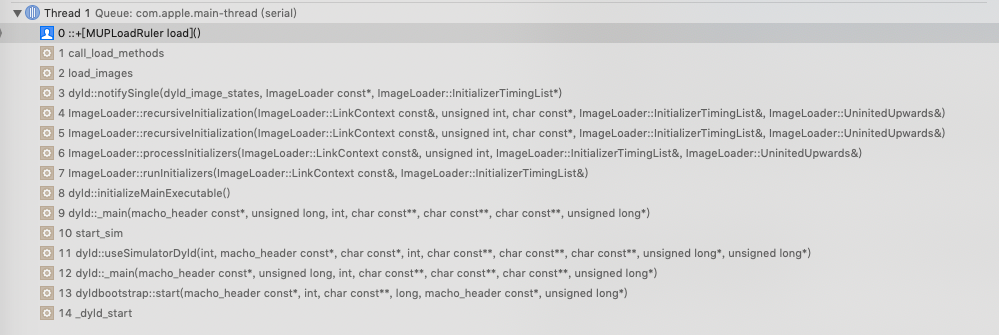
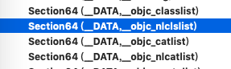
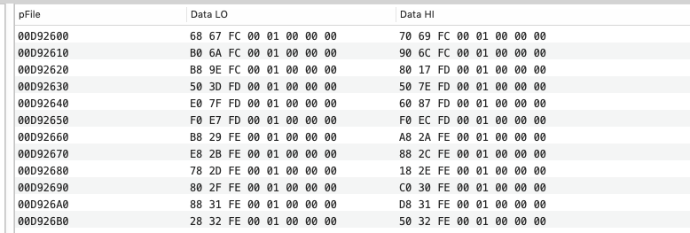
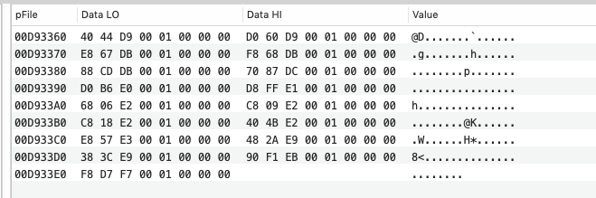
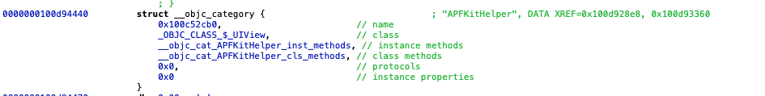
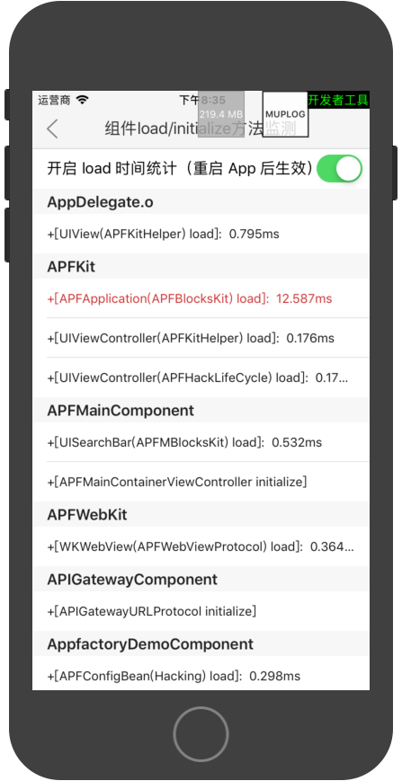

### 背景

目前部分产品反馈启动时间还是较慢。但目前启动时间耗时统计方案无法统计到 main 方法之前的 load 方法耗时，无法定位耗时长的组件代码。

### 第三方方案：[Hook所有+load方法（包括Category）](https://mp.weixin.qq.com/s/kL__CM3CfP_7i8Obg8qzWQ)

该方案通过 Hook 所有 Class 中的 load 方法的方式实现了 load 方法的替换。在替换的方法前后加入耗时统计函数，从而实现 load 方法耗时统计。

但是该方案遍历 load 方法的过程是通过查找所有的镜像，然后通过 `const char * _Nonnull * _Nullable objc_copyClassNamesForImage(const char * _Nonnull image,  unsigned int * _Nullable outCount) ` 方法找到所有的类，再遍历所有类中的所有方法，从而捞出了所有的 +load 方法。

#### 优点

这个方案中有一个非常值得借鉴的点：将 Hook 方法写在动态库中，若让主工程包只依赖该动态库。使得该动态库一定可以最先被加载。在该动态库中唯一一个 +load 方法中去检测整个 App 中所有的类，确保可以在其他任何类加载前对其进行检测，和方法替换。

#### 缺点

以目前一个中等大小的应用工厂组装产品为例，需要耗时大约150ms，以99u这样的平台型 App 而言，耗时至少会增加一倍以上。而这一切都是在工程启动的时候做的，若在每次启动时都开始 load 耗时检测，那这个 Hook 过程的耗时肯定不能接受。哪怕是选择启用，这样的耗时也十分影响体验。所以本篇文章将说明如何在这个方案的基础上进行改进。

### load 耗时检测的思路：

#### 思路一

通过在最早 load 的方法中加入一个获取到所有需要被执行load方法的类及分类，并对其进行 method swizzling 替换。

#### 思路二

对执行 load 方法的程序调用栈上的关键函数进行 fishhook ，从而实现获取到 load 方法关键信息，并对关信息（如 IMP、SEL 、Class 等）做处理。

### 探究 + load 方法调用过程

#### dyld 和 objc 库静态分析

从 App 启动到加载到这个动态库第一个 load 方法过程中经历了哪些过程呢？

我们可以通过打断点的方式查看这个堆栈。



这里可以看到程序入口是：

_dyld_start ，这是一个汇编的入口，其目的是加载、启动 dyld 库解析 App 的动态库依赖，然后在 objc 库中进行image 的加载。这两个库在 `/usr/lib` 路径下，我们可以通过 Mach-O 文件看到其中的函数名。由于它是开源的。我们可以在 [dyld 源码（在线版）](https://opensource.apple.com/source/dyld/)  在线阅读它，也可以通过 [dyld源码（下载版）](https://opensource.apple.com/tarballs/dyld/) 下载到本地阅读。

我们下载 dyld-551.4 、objc4-723 这两个库到本地进行静态分析。

堆栈中可以看到，在栈底处 `12 dyld::_main` 中正式地开始加载程序，进行动态库以来解析等。在 `3 dyld::notifySingle` 中调用 objc 中的 `load_images` 进行镜像的加载，在加载过程中进行了 load 的初始化。

知道了 +load 初始化的大致过程后，我们可以深入代码细节进行分析。

我们从栈顶开始反向看 +load 方法被调用过程。在 objc 库中的 `objc-loadmethod.m` 文件找到 `call_class_loads` 方法：

```objc
static void call_class_loads(void){
    int i;
    // Detach current loadable list.
    //这是所有符合条件可被执行load的类
    struct loadable_class *classes = loadable_classes;
    int used = loadable_classes_used;
    loadable_classes = nil;
    loadable_classes_allocated = 0;
    loadable_classes_used = 0;
    // Call all +loads for the detached list.
    for (i = 0; i < used; i++) {
        Class cls = classes[i].cls;
        //此处取到 load 方法的 IMP
        load_method_t load_method = (load_method_t)classes[i].method;
        if (!cls) continue; 
        if (PrintLoading) {
            _objc_inform("LOAD: +[%s load]\n", cls->nameForLogging());
        }
        //此次进行load初始化
        (*load_method)(cls, SEL_load);
    }
    // Destroy the detached list.
    if (classes) free(classes);
}
```

这一步中有两个地方值得注意：

- 所有需要被执行 load 方法的类已经被放到 loadable_classes 链表中了
- load 的 IMP 是存在结构体中的。这个关键信息在本次开发中虽然没有用上，但在后续的思考和改进中存在一定的利用空间。

该方法被 `call_load_methods` 方法调用，`call_class_loads` 方法实现如下：

```objc
void call_load_methods(void) {
    static bool loading = NO;
    bool more_categories;
    loadMethodLock.assertLocked();
    // Re-entrant calls do nothing; the outermost call will finish the job.
    if (loading) return;
    loading = YES;
    void *pool = objc_autoreleasePoolPush();
    do {
        // 1. Repeatedly call class +loads until there aren't any more
        while (loadable_classes_used > 0) {
            //加载类 load
            call_class_loads();
        }
        // 2. Call category +loads ONCE
        //加载分类 load
        more_categories = call_category_loads();
        // 3. Run more +loads if there are classes OR more untried categories
    } while (loadable_classes_used > 0  ||  more_categories);
    objc_autoreleasePoolPop(pool);
    loading = NO;
}
```

该方法就是先加载所有类的 load，再加载所有分类的 load。该方法被 `load_images` 调用

```objc
void load_images(const char *path __unused, const struct mach_header *mh) {
    // Return without taking locks if there are no +load methods here.
    if (!hasLoadMethods((const headerType *)mh)) return;
    recursive_mutex_locker_t lock(loadMethodLock);
    // Discover load methods {
        rwlock_writer_t lock2(runtimeLock);
        prepare_load_methods((const headerType *)mh);
    }
    // Call +load methods (without runtimeLock - re-entrant)
    call_load_methods();
}
```

上文说到：进行 load_method 调用的时候，所有需要被调用的 load 的方法已经被加入到链表中了，那么它们是怎么被加入到链表中、何时被加入到链表中呢？

答案是：在 `load_images` 中的 `prepare_load_methods((const headerType *)mh);`进行镜像文件预加载/解析的时候生成了 `loadable_classes` 链表。

`prepare_load_methods` 方法实现如下：

```objc
void prepare_load_methods(const headerType *mhdr){
    size_t count, i;
    runtimeLock.assertWriting();
    //此处获取到所有需要被执行load方法的类
    classref_t *classlist = 
        _getObjc2NonlazyClassList(mhdr, &count);
    for (i = 0; i < count; i++) {
        //此处对类进行remap
        schedule_class_load(remapClass(classlist[i]));
    }
    //此处获取到所有需要被执行load方法的分类
    category_t **categorylist = _getObjc2NonlazyCategoryList(mhdr, &count);
    for (i = 0; i < count; i++) {
        category_t *cat = categorylist[i];
        //此处肤对分类进行remap
        Class cls = remapClass(cat->cls);
        if (!cls) continue;  // category for ignored weak-linked class
        realizeClass(cls);
        assert(cls->ISA()->isRealized());
        add_category_to_loadable_list(cat);
    }
}
```

通过 `_getObjc2NonlazyClassList` 和 `_getObjc2NonlazyCategoryList` 分别获取到需要被执行 load 方法的类和分类的链表。这两个方法内部实现如下：

```c++
typedef struct classref * classref_t;

struct category_t {
    const char *name;
    classref_t cls;
    struct method_list_t *instanceMethods;
    struct method_list_t *classMethods;
    struct protocol_list_t *protocols;
    struct property_list_t *instanceProperties;
    // Fields below this point are not always present on disk.
    struct property_list_t *_classProperties;

    method_list_t *methodsForMeta(bool isMeta) {
        if (isMeta) return classMethods;
        else return instanceMethods;
    }

    property_list_t *propertiesForMeta(bool isMeta, struct header_info *hi);
};

#define GETSECT(name, type, sectname)                                   \
    type *name(const headerType *mhdr, size_t *outCount) {              \
        return getDataSection<type>(mhdr, sectname, nil, outCount);     \
    }                                                                   \
    type *name(const header_info *hi, size_t *outCount) {               \
        return getDataSection<type>(hi->mhdr(), sectname, nil, outCount); \
    }

GETSECT(_getObjc2NonlazyClassList,    classref_t,      "__objc_nlclslist");
GETSECT(_getObjc2NonlazyCategoryList, category_t *,    "__objc_nlcatlist");

template <typename T>
T* getDataSection(const headerType *mhdr, const char *sectname, size_t *outBytes, size_t *outCount) {
    unsigned long byteCount = 0;
    T* data = (T*)getsectiondata(mhdr, "__DATA", sectname, &byteCount);
    if (!data) {
        data = (T*)getsectiondata(mhdr, "__DATA_CONST", sectname, &byteCount);
    }
    if (!data) {
        data = (T*)getsectiondata(mhdr, "__DATA_DIRTY", sectname, &byteCount);
    }
    if (outBytes) *outBytes = byteCount;
    if (outCount) *outCount = byteCount / sizeof(T);
    return data;
}
```

此处用的C++ 的模板方法从 Mach-O 文件的 `__DATA` 章节中的 `__objc_nlclslist` 和 `__objc_nlcatlist` 段中分别获取到指向类描述结构体、分类描述结构体地址的指针。然后通过 remap 的方式拿到类对象、分类对象的指针，加入链表。

#### 逆向 Mach-O 文件进行验证。

为验证我们的解析结果，我们取一个现有 App 中的 Mach-O 文件进行检验：

用 MachOView 工具打开 Mach-O 文件，确实在其中看到 `__objc_nlclslist` 和 `__objc_nlcatlist` 等段。




从`NonlazyClass`的命名上可以推断出：含有 load 方法的类属于**非懒加载类**，

同理，从从`NonlazyCategory`的命名上可以推断出：含有 load 方法的类属于**非懒加载分类**。

##### 非懒加载类存储方式

`__objc_nlclslist`段部分数据展示如下：




里面的数据如 `68 67 fc 00 01 00 00 00 ` ，此处存储的是大端序的数据，将其转化为小端序后即： `00 00 00 01 00 fc 67 68` 。

找到 `00 00 00 01 00 fc 67 68` 地址上的数据，确实是存储类描述结构体（即`struct classref`）数据的地址。经验证该类确实实现了 load 方法。所以大致验证我们的猜测正确。


objc 库通过读取 Mach-O 文件中非懒加载类表和非懒加载分类表的方式实现 + load 方法加载的方案确实优于第三方提供的遍历所有类然后筛选出实现了 + load 方法的类列表的方案。

##### 非懒加载分类存储方式

同理，我们可以找到 `__objc_nlcatlist` 段部分数据，如下所示：



里面的数据如 `40 44 D9 00 01 00 00 00 ` ，将其转化为小端序后即： `00 00 00 01 00 D9 44 40` 。

找到 `00 00 00 01 00 D9 44 40` 地址上的数据，确实是存储分类描述结构体（即 `struct category_t` ）数据的地址。



### 方案实现

#### 基于思路一实现：

弄懂 `load` 函数遍历、调用过程，但是可以看到的是以上涉及的方法都是 objc 的内部方法，外部无法进行直接调用。所以就得精简代码后，进行整合、使用。

首先：从动态库加载的时候，遍历需要加载的镜像列表，找到我们需要解析的镜像：

```objc
/**
 获取主工程 Mach-O 文件入口指针

 @return Mach-O 文件入口指针
 */
const struct mach_header *get_target_image_header() {
    if (target_image_header == NULL) {
        for (int i = 0; i < _dyld_image_count(); i++) {
            const char *image_name = _dyld_get_image_name(i);
             const char *target_image_name = ((NSString *)[[[NSBundle mainBundle] infoDictionary] objectForKey:@"CFBundleName"]).UTF8String;
            if (strstr(image_name, target_image_name) != NULL) {
                target_image_header = _dyld_get_image_header(i);
                break;
            }
        }
    }
    return target_image_header;
}
```

然后从镜像文件中捞出我们想要的非懒加载类和分类链表：其中 `_getObjc2NonlazyCategoryList` 和 `_getObjc2NonlazyClassList ` 可以基本照搬 objc 库中实现。

```objc
category_t **get_non_lazy_categary_list(size_t *count) {
    category_t **nlcatlist = NULL;
    nlcatlist = _getObjc2NonlazyCategoryList((headerType *)get_target_image_header(), count);
    return nlcatlist;
}

classref_t *get_non_lazy_class_list(size_t *count) {
    classref_t *nlclslist = NULL;
    nlclslist = _getObjc2NonlazyClassList((headerType *)get_target_image_header(), count);
    return nlclslist;
}

```

所以整个遍历非懒加载类及分类并通过 method swizzling 替换的过程如下：

```objc
+ (void)load {
    NSString *path = NSSearchPathForDirectoriesInDomains(NSDocumentDirectory, NSUserDomainMask, YES).firstObject;
    NSFileManager *fileManager = [NSFileManager defaultManager];
    NSString *apfDocPath = [NSString stringWithFormat:@"这段路径不重要，隐藏", path];
    if(![fileManager fileExistsAtPath:apfDocPath]){
        return;
    }
    size_t count = 0;
    classref_t *nlclslist = get_non_lazy_class_list(&count);
    //最后一位指向的结构体中isa变量指向0x00000000的指针，故排除
    for (int i = 0; i < count - 1; i++) {
        Class cls = (Class)CFBridgingRelease(nlclslist[i]);
        cls = object_getClass(cls);
        swizzeLoadMethodInClass(cls, NO);
    }
    
    nlcategarylist = get_non_lazy_categary_list(&categaryCount);
    for (int i = 0; i < categaryCount; i++) {
        Class cls = (Class)CFBridgingRelease(nlcategarylist[i]->cls);
        cls = object_getClass(cls);
        swizzeLoadMethodInClass(cls, YES);
    }
}
```

#### 其他要点

值得注意的是：

##### `classref_t` 类型

`get_non_lazy_class_list` 返回类型是 `classref_t` 。

由 `typedef struct classref * classref_t;` 得知：这个类型是 `struct classref *` 。那么 `struct classref` 是什么类型呢？在 Mach-O文件解析中，我们看到其类型是 `struct objc_class` 。所以： `struct classref` 的类型就是 `struct objc_class` 。

##### `category_t *` 类型

可以看到 `struct category_t` 的类型定义如下：

```objc
struct category_t {
    const char *name;
    classref_t cls;
    struct method_list_t *instanceMethods;
    struct method_list_t *classMethods;
    struct protocol_list_t *protocols;
    struct property_list_t *instanceProperties;
    // Fields below this point are not always present on disk.
    struct property_list_t *_classProperties;
    method_list_t *methodsForMeta(bool isMeta) {
        if (isMeta) return classMethods;
        else return instanceMethods;
    }
    property_list_t *propertiesForMeta(bool isMeta, struct header_info *hi);
};
```

这里，引入了  `struct method_list_t *` ,  `struct protocol_list_t *` 等，我们此次功能开发中不用的类型。所以在进行 `struct category_t` 类型引入的时候，做了个精简，能够通过编译即可。

```objc
struct category_t {
    const char *name;
    classref_t cls;
    void *instanceMethods;
    void *classMethods;
    void *protocols;
    void *instanceProperties;
    void *_classProperties;
    void *methodsForMeta(bool isMeta) {
        if (isMeta) return classMethods;
        else return instanceMethods;
    }
    void *propertiesForMeta(bool isMeta, struct header_info *hi);
};
```

#### 结果

原本采用第三方的方案，做完一个中等大小 App 的 load 方法 hook 大概需要150 ms ，采用改进后的方案，可以控制在 10ms 以内。虽然这样的效果还达不到让人无感知的程度，所以在生产环境下，目前只是在开发者工具中进行选择启用。

这是最终效果图：




#### 关于思路二的思考

因为思路一的实现方案，虽然是比第三方的实现方案快了十倍以上，但是我觉得还没有到我很满意的程度。所以我这里也做了一些关于思路二可行性的思考，做一个简单的记录。

上文提到：在 objc 库中的 `objc-loadmethod.m` 文件找到 `call_class_loads` 方法，`call_class_loads`方法中有 `load_method_t load_method = (load_method_t)classes[i].method;` 这个 load_method ，就是 +load 方法的 IMP，如果可能拿到这个 IMP，并指向一个 HOOK 后的 IMP，在hook方法之中，调用源 IMP ，其实也是一个非常不错的方案。

那么有办法更加高效地拿到这个 IMP 吗？

我觉得可能有。

这个 IMP 在何时何处被赋值呢？

在执行 `prepare_load_methods` 时被赋值，在 `objc-loadmethod.m` 被调用。

```objc
void add_class_to_loadable_list(Class cls){
    IMP method;
    loadMethodLock.assertLocked();
    method = cls->getLoadMethod();
    if (!method) return;  // Don't bother if cls has no +load method
    if (PrintLoading) {
        _objc_inform("LOAD: class '%s' scheduled for +load", cls->nameForLogging());
    }
    if (loadable_classes_used == loadable_classes_allocated) {
        loadable_classes_allocated = loadable_classes_allocated*2 + 16;
        loadable_classes = (struct loadable_class *)
            realloc(loadable_classes, loadable_classes_allocated * sizeof(struct loadable_class));
    }
    loadable_classes[loadable_classes_used].cls = cls;
    loadable_classes[loadable_classes_used].method = method;
    loadable_classes_used++;
}
```

这个 `add_class_to_loadable_list` 方法比较长，想要完整地通过 fishhook （考虑不同系统和版本）进行替换，其实难度比较高。但是其中 `method = cls->getLoadMethod();` 这个过程其实是有一定机会的， `cls->getLoadMethod` 方法如下：

```objc
IMP objc_class::getLoadMethod(){
    runtimeLock.assertLocked();
    const method_list_t *mlist;
    assert(isRealized());
    assert(ISA()->isRealized());
    assert(!isMetaClass());
    assert(ISA()->isMetaClass());
    mlist = ISA()->data()->ro->baseMethods();
    if (mlist) {
        for (const auto& meth : *mlist) {
            const char *name = sel_cname(meth.name);
            if (0 == strcmp(name, "load")) {
                return meth.imp;
            }
        }
    }
    return nil;
}

```

这个方法是有一定机会通过 fishhook 替换。难道包括且不只于以下几个方面：

- 这是 C++ 的类方法，如果通过 fishhook ，我们需要知道其经过函数签名之后的方法名（这个可以通过包逆向做到），但是如何保证这个修饰后的名称不变且稳定是一个困难点。
- 通过 fishhook 的方案可行性、性能待论证。 

### 关于 iOS load 机制的思考

#### 为什么会有 load 机制

从 objc 库静态解析结果和 Mach-O 文件分析结果来看。实现了 load 方法的类都是存在 `__objc_nlclslist`、`__objc_nlcatlist` 中。为什么要存在这里呢？其实这两个段只是非懒加载类的索引。在 App 启动前，加载的过程中需要执行 load 方法的类可以通过索引遍历出来，然后执行 load 方法，这是 iOS 刻意提供的一种机制，并非一个自然的加载过程中一个顺便的行为。

那么其他懒加载的类全数会在App启动的时候被加载吗？我虽然还没有对代码做一个更加深入的分析，但是有理由相信是：不会的。

为什么呢？因为从软件开发至今。内存从来都是昂贵且稀有的。App 绝大部分情况下会少占用内存、有效地利用内存。而且程序运行的时候是有局部性原理的。所以只有程序必须要用到、最常用到的部分才需要有效地驻留在内存内。

在软件开发的早期阶段，装载软件镜像主要通过覆盖载入，程序员需要手动管理代码段之间依赖关系。而现在采用的的是页映射的方式。所以那些懒加载的类应该是不会被加载进内存，只有发生缺页、断页的情况，才会加载对应的类、对应的代码段。

因为大部分的类都是懒加载的，而有些事情必须在 App 启动的时候做、在 main 方法之前做，所以才提供了 load 的机制。如果没有这种机制，那么所有的操作只能在 main 方法之后做。对于有些操作来说就太迟了。

#### load 应该用来做什么事情

我曾见过有项目在 load 中初始化了用户信息，让其他业务模块能够尽早使用到用户信息，而用户信息中包含了头像 image ，头像从 `SDWebImage` 中获取。这么做 直接导致 `SDWebImage` 库初始化，在 SDWebImage 初始化的过程中还 create 了两条 queue 来处理数据。这么做直接导致了大量类的初始化树和初始化周期被改变。

还见过有项目在 load 中初始化了三个 `NSDateFormtter` ，要知道 `NSDateFormtter` 的初始化是非常耗时的， 而且这个 NSDateFormtter 并没有立刻用到（这是存心来找茬的吧）。 

以上两个都是反例。

那么load 应该用来做什么事情呢？

我觉得 method_swizzling 可以放在 load 中做，还有一些简单的数据统计、钩子相关的东西可以放在 load 中做，以求获取到更多的信息。

但是任何和业务相关的初始化都不应该放在load 中做。load 就是一个潘多拉魔盒， A 业务放在 load 中初始化了，那么 A 依赖的业务 也务必要放在 load 中初始化，这里无论是显式依赖导致的被动初始化，还是隐式依赖所导致的主动初始化。一旦打开了，就刹不住车了。